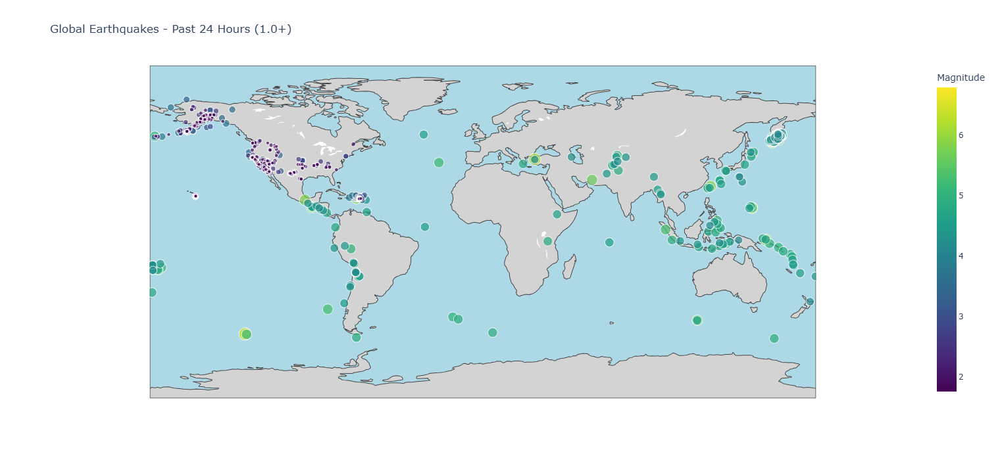

# Earthquake Visualization

A simple Python application that creates an interactive world map of recent earthquakes using real-time data from USGS.



## Installation
```bash
pip install plotly
```

## Usage
Edit the [`config.json`](config.json) file to adjust filters and visualization options:
```bash
{
  "time_period": {
    "days": 10,
    "description": "past 24 hours"
  },
  "earthquake_filters": {
    "minmagnitude":0.0,
    "orderby": "magnitude"
  },
  "api_settings": {
    "format": "geojson",
    "limit": 1000
  },
  "visualization": {
    "title": "Global Earthquakes - Past 24 Hours (1.0+)",
    "size_multiplier": 4,
    "min_marker_size": 3,
    "colorscale": "Viridis"
  }
}
```
and just run:

```bash
python main.py
```
This will create global_earthquakes.html and open it in your browser.

## Data Source

[USGS Earthquake FDSN Event API](https://earthquake.usgs.gov/fdsnws/event/1/)

<sub>This project uses earthquake hazard data provided by the U.S. Geological Survey (USGS). The data are in the public domain.</sub>
